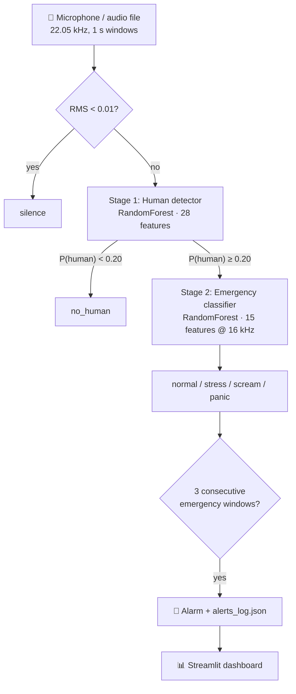

# 🚨 Acoustic Survivor Detection Under Rubble

**Detecting trapped survivors after an earthquake by listening for stressed and panicked human voices.**

A real-time, two-stage audio pipeline: it first decides whether a sound contains a
human voice, then classifies the emotional state of that voice (normal / stress /
scream / panic). When several consecutive windows look like an emergency, it raises
an alarm, logs it, and shows it on a live dashboard.


---

## Contents

- [Why](#why)
- [How it works](#how-it-works)
- [Project structure](#project-structure)
- [Installation](#installation)
- [Usage](#usage)
- [Data](#data)
- [Training](#training)
- [Evaluation](#evaluation)
- [Known limitations](#known-limitations)
- [Roadmap](#roadmap)
- [License](#license)

---

## Why

In the first 72 hours after an earthquake, locating people trapped under debris is a
race against time. Rescue teams already use acoustic listening devices, but a person
has to interpret the sound. This project explores whether a lightweight model can
listen continuously and flag the moments that most likely contain a person in
distress, so operators can focus their attention there.

Design goals:

- **Real time on a laptop CPU.** Inference takes about 30–60 ms per 1-second window.
- **Few false alarms.** A two-stage design plus a consecutive-window counter.
- **Explainable.** Hand-crafted acoustic features and tree ensembles, no black-box
  deep model.

---

## How it works



### Stage 1: Is there a human voice?

A binary RandomForest (300 trees) trained on emotional speech corpora (human) and
environmental sounds (non-human).

| # | Feature |
|---|---|
| 13 | MFCC means |
| 13 | MFCC standard deviations |
| 1 | Zero-crossing rate (mean) |
| 1 | RMS energy (mean) |

### Stage 2: What state is the voice in?

A 4-class RandomForest (300 trees, class-balanced). The audio is resampled to
16 kHz first, the rate the model was trained at.

| # | Feature |
|---|---|
| 13 | MFCC means |
| 1 | RMS energy (mean) |
| 1 | Spectral centroid (mean) |

A window counts as an emergency when the predicted class is not `normal` and
`P(stress) + P(scream) + P(panic) ≥ 0.5`. The live listener alarms after
**3 consecutive** emergency windows and then waits a 5-second cooldown.

Every feature definition lives in a single module, [`features.py`](features.py),
imported by both the training scripts and the live pipeline. This makes it
structurally impossible for training and inference to compute different features.

---

## Project structure

```
├── features.py                    # single source of truth for feature extraction
├── pipeline.py                    # two-stage inference (analyze_file / analyze_audio_array)
├── audio_input.py                 # CLI: analyse one audio file
├── live_listener.py               # real-time microphone listener + alarm logic
├── app.py                         # Streamlit dashboard for alerts_log.json
│
├── scripts/download_data.py       # fetches datasets from their original sources
├── augment_data.py                # speech augmentation (noise, shift, pitch, speed)
├── augment_non_human.py           # light augmentation for environmental sounds
├── prepare_emergency_dataset.py   # builds data_emergency/{normal,stress,scream,panic}
├── sample_dataset.py              # balanced human / non-human sampling
├── extract_emergency_features.py  # → features/X_emergency.npy
├── extract_human_features_fast.py # → features/X_human_detector.npy
├── train_emergency_classifier.py  # → models/emergency_classifier.pkl
├── train_human_detector_mid.py    # → models/human_detector_mid.pkl
│
├── models/                        # trained models (Git LFS)
├── features/                      # cached feature matrices
├── deneme sesleri/                # sample clips for a quick try
└── tests/                         # pytest suite
```

---

## Installation

```bash
git clone https://github.com/BurakYildizGameDev/Stress_Detection_from_Sound_Signals_and_Application_to_Detecting_Survivors_Under_Rubble.git
cd Stress_Detection_from_Sound_Signals_and_Application_to_Detecting_Survivors_Under_Rubble
git lfs pull                      # trained models
pip install -r requirements.txt
```

> The models were saved with **scikit-learn 1.8.0**, which is pinned in
> `requirements.txt`. Other versions emit `InconsistentVersionWarning` and may
> produce wrong predictions.

---

## Usage

### Analyse a file

```bash
python audio_input.py "deneme sesleri/peopleTalk.mp3"
```

```
[+] Canli Varligi: TESPIT EDILDI (Guven: %99.6)
[+] Durum: NORMAL
[+] Acil Durum Olasiligi: %39.9
[NORMAL] Acil Durum Alarmi: HAYIR

Sinif Dagilimi:
   - Normal  : %60.1
   - Stress  : %15.7
   - Scream  : %1.3
   - Panic   : %22.8
```

### Listen in real time

```bash
python live_listener.py
```

Each 1-second window prints the predicted state, its confidence and the probability
of a human voice. Emergencies are appended to `alerts_log.json`.

### Dashboard

```bash
streamlit run app.py
```

The dashboard has three tabs:

- **Dashboard:** last activity, total alerts, and counts per state.
- **Alert logs:** a table of every alert with CSV export.
- **Statistics:** state distribution chart, average class probabilities, and summary metrics.

It refreshes automatically, and the refresh rate is set from the sidebar.

### Use it from Python

```python
from pipeline import analyze_file, analyze_audio_array

result = analyze_file("recording.wav")
# {'status': 'DETECTED', 'state': 'panic', 'is_emergency': True,
#  'human_prob': 0.82, 'emergency_prob': 0.77, 'all_probs': {...}}
```

### Tests

```bash
python -m pytest tests
```

---

## Data

The datasets are **not redistributed** in this repository, because several of them
have non-commercial or no-derivatives licenses. The download script fetches them
from their original sources into the layout the training scripts expect:

```bash
python scripts/download_data.py --list    # sources and licenses
python scripts/download_data.py           # everything that can be fetched automatically
python scripts/download_data.py tess      # a single dataset
```

| Dataset | Language | Role | License | Download |
|---|---|---|---|---|
| [RAVDESS](https://zenodo.org/records/1188976) (song) | English | human | CC BY-NC-SA 4.0 | automatic |
| [Berlin EMO-DB](http://emodb.bilderbar.info/) | German | human | free w/ attribution | automatic |
| [TESS](https://doi.org/10.5683/SP2/E8H2MF) | English | human | CC BY-NC 4.0 | automatic |
| [SUBESCO](https://zenodo.org/records/4526477) | Bangla | human | CC BY 4.0 | automatic (~1.7 GB) |
| [SAVEE](http://kahlan.eps.surrey.ac.uk/savee/) | English | human | research only | manual |
| [JL-Corpus](https://www.kaggle.com/datasets/tli725/jl-corpus) | English (NZ) | human | CC0 | manual |
| [ESC-50](https://github.com/karolpiczak/ESC-50) | — | non-human | CC BY-NC 3.0 | automatic |

The emergency dataset, built by `prepare_emergency_dataset.py`, contains
**1,542 clips**: 500 normal, 500 stress, 42 scream and 500 panic.

---

## Training

```bash
# Emergency classifier
python prepare_emergency_dataset.py
python extract_emergency_features.py
python train_emergency_classifier.py

# Human detector
python sample_dataset.py
python extract_human_features_fast.py
python train_human_detector_mid.py
```

---

## Evaluation

The emergency classifier was evaluated four ways, from most optimistic to most
realistic:

| Protocol | Accuracy | Macro-F1 |
|---|---|---|
| Random 80/20 split (as in the training script) | 0.864 | 0.706 |
| Augmented copies kept on the same side of the split | 0.808 | 0.613 |
| **Speaker-independent 5-fold CV** | **0.630 ± 0.11** | **0.572** |
| Unseen corpus (SUBESCO held out) | 0.439 | 0.302 |

The random-split score is inflated: augmented copies of the same clip, and the same
speakers, end up in both the training and test sets. **The speaker-independent
figure is the one that reflects real-world performance.** The gap to the
unseen-corpus figure shows how strongly the model depends on recording conditions
and language.

Results on the sample clips, using 1-second windows:

| Clip | Result | Verdict |
|---|---|---|
| `peopleTalk.mp3` | 4 normal, 1 stress | ✅ |
| `carstart.mp3` | no human | ✅ |
| `bird.mp3` | 5/5 windows flagged as emergency | ❌ false alarm |
| `deneme woman scream.mp3` | mostly "no human", never `scream` | ❌ missed |

---

## Known limitations

These are stated openly on purpose:

1. **The `scream` class does not contain real screams.** It is built by matching
   "shout" in file names. In TESS, "shout" is one of the *spoken target words*, so
   the class consists of 14 recordings (42 after augmentation) of someone saying the
   word "shout".
2. **False alarms on non-speech sounds** such as birdsong. The non-human training set
   does not cover enough sound categories.
3. **Clip-length mismatch.** Training uses 2–3 s clips, while inference uses 1 s
   windows.
4. **No Turkish speech** in the training data, even though the target deployment is
   in Turkey.
5. **No rubble acoustics.** The models were never trained on audio that passed
   through concrete and debris, which is strongly low-pass filtered and reverberant.

---

## Roadmap

- [x] Single feature module shared by training and inference
- [x] Dataset download script; no redistribution of licensed audio
- [x] pytest suite
- [ ] Real scream data (e.g. the AudioSet *Screaming* class) and all 50 ESC-50 classes as negatives
- [ ] Speaker-independent training and a confusion matrix in this README
- [ ] Knock/tap detection via onset analysis, the most realistic signal from under rubble
- [ ] Pretrained audio embeddings (YAMNet / PANNs) as features
- [ ] Room-impulse-response augmentation to simulate debris
- [ ] ONNX export for edge devices
- [ ] GitHub Actions CI

---

## License

The code is released under the [MIT License](LICENSE). The datasets keep their own
licenses; see the table above or run `python scripts/download_data.py --list`.
