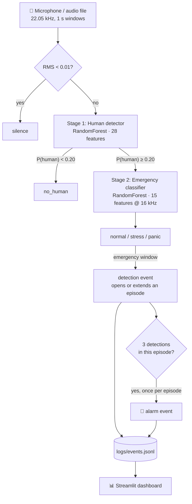

# 🚨 Acoustic Survivor Detection Under Rubble

**Detecting trapped survivors after an earthquake by listening for stressed and panicked human voices.**

A real-time, two-stage audio pipeline: it first decides whether a sound contains a
human voice, then classifies the emotional state of that voice (normal / stress /
panic). Consecutive emergency windows are grouped into one episode, and an episode
that lasts long enough raises a single operator alarm on a live dashboard.

> **Status:** an operator aid and research prototype, not a rescue decision tool.
> It has not been tested on audio recorded through real rubble; see
> [docs/EVALUATION.md](docs/EVALUATION.md).


[](https://github.com/BurakYildizGameDev/Stress_Detection_from_Sound_Signals_and_Application_to_Detecting_Survivors_Under_Rubble/actions/workflows/ci.yml)

---

## Contents

- [The story behind this project](#the-story-behind-this-project)
- [Türkçe özet](#türkçe-özet)
- [Project timeline](#project-timeline)
- [Challenges and lessons learned](#challenges-and-lessons-learned)
- [The real data problem](#the-real-data-problem)
- [Why](#why)
- [How it works](#how-it-works)
- [Project structure](#project-structure)
- [Installation](#installation)
- [Usage](#usage)
- [Data](#data)
- [Training](#training)
- [Evaluation](#evaluation)
- [Embedded prototype (ESP32-S3)](#embedded-prototype-esp32-s3)
- [Known limitations](#known-limitations)
- [Roadmap](#roadmap)
- [License](#license)

---

## The story behind this project

On 6 February 2023, two major earthquakes centred in Kahramanmaraş struck southern
Türkiye and northern Syria. Tens of thousands of people lost their lives and many
more were trapped under collapsed buildings.

I lived through that earthquake. I came out of it unharmed, but I saw what the
region looked like in the days that followed. In the search-and-rescue work across
the region, the same scene kept repeating: rescuers asked everyone around a
collapsed building to fall completely silent, so they could listen for a voice, a
moan or a knock coming from under the debris. Finding a living person often depended
on someone hearing a very weak sound, in a noisy place, after days without sleep.

That is where this project started. The question was simple:

> Can a computer help rescuers listen? Can it keep listening without getting tired,
> and point out the moments that most likely contain a person in distress?

I began it as my final-year artificial intelligence course project, and kept working
on it after the course ended. The goal was never to replace rescuers or their
listening devices. It is to build an **honest, testable prototype** that shows what
works, what does not, and what it would take to make it useful in the field.

### What this project is, and what it is not

| It is | It is not |
|---|---|
| A research prototype of an acoustic "second pair of ears" for rescue operators | A rescue decision tool. No one should be declared alive or dead by this system |
| Openly evaluated, with its failures published next to its successes | Tested on audio recorded through real rubble (no such data exists in this project yet) |
| A complete pipeline: data, features, models, live listener, dashboard, embedded prototype | Trained on real trapped people. All training speech is acted |

---

## Türkçe özet

6 Şubat 2023 Kahramanmaraş depremini yaşadım. Sağlığım yerinde, ama sonraki günlerde
bölgenin hâlini gördüm. Enkaz başında kurtarma ekipleri herkesten tam sessizlik
istiyor, göçük altından gelebilecek bir sesi, inlemeyi ya da vuruşu dinliyordu. Bu
proje oradan doğdu: **bilgisayar kurtarıcıların dinlemesine yardım edebilir mi?**

Proje, yapay zekâ dersinin bitirme çalışması olarak başladı ve ders bittikten sonra da
geliştirilmeye devam etti. Sistem iki aşamalı çalışır: önce seste insan sesi olup
olmadığına karar verir, sonra bu sesin durumunu sınıflandırır (normal, stres, panik;
deneysel v2'de fısıltı ve inleme de var). Art arda gelen acil durum pencereleri tek bir
bölümde toplanır ve operatöre tek bir alarm gider. Canlı dinleyici, Streamlit paneli ve
yalnızca simülasyonda test edilmiş bir ESP32-S3 prototipi var.

En önemli sonuç şu: **sistem bugün sahada kullanılabilir değil ve bunun asıl sebebi
gerçek veri eksikliği.** Eğitim verisinin tamamı oyuncuların okuduğu cümlelerden
oluşuyor. Türkçe konuşma, gerçek fısıltı ve gerçek enkaz arkasından kaydedilmiş ses
yok. Boğuk ve kısık sesler çoğunlukla "normal" sanılıyor. Aşağıdaki
[Gerçek veri ihtiyacı](#the-real-data-problem) bölümü hangi verinin neden gerektiğini
ve nasıl toplanabileceğini anlatıyor. AFAD, AKUT, üniversiteler ya da gönüllü kayıt
yapmak isteyenlerle çalışmaya açığım.

---

## Project timeline

The git history records how the project grew. In short:

| Period | Phase | What happened |
|---|---|---|
| Nov 2025 | Start | Repository, audio loading, first acoustic features (RMS, zero-crossing rate, spectral centroid, MFCC) |
| Nov – Dec 2025 | Data | Parsers for seven emotional-speech corpora and ESC-50; a download script, so licensed audio is never redistributed |
| Dec 2025 – Jan 2026 | Robustness and splits | Rubble-like augmentation (noise, low-pass, attenuation); **speaker-disjoint** train/test splits |
| Feb 2026 | Models | Stage 1 human detector and stage 2 emergency classifier (Random Forests); model metadata with feature specs |
| Mar 2026 | Evaluation | Held-out speakers, unseen corpora and simulated rubble. The honest numbers turned out much lower than the first ones (see below) |
| Mar – Apr 2026 | Live system | Episode and alarm logic, live microphone listener, Streamlit dashboard; course release on 24 April 2026 |
| Sep 2026 | v2 | Whisper and moan classes, loudness-normalised features, VIVAE as a real external test set, non-verbal vocalisations for the human detector |
| Sep 2026 | Embedded prototype | ESP32-S3 firmware, C export of the models, host and Wokwi simulators, GitHub Actions CI, three rounds of independent code review |

---

## Challenges and lessons learned

This section is the most useful part of the project for anyone who wants to build
something similar. Most of the work was not about getting a model to run; it was
about finding out whether the numbers could be trusted.

### 1. The first result was too good to be true

The first emergency classifier scored **0.864 accuracy**. That number was produced
with a random 80/20 split in which augmented copies of the same recording ended up
on both sides, and the same speakers appeared in both training and test. The model
was partly recognising voices it had already heard.

After splitting by speaker, augmenting only the training side, and parsing labels
from each corpus's own naming scheme, the comparable number is **0.666**. On a
corpus the model has never seen it drops to 0.23–0.59 macro-F1. The lower number is
the real one, and every later decision was based on it.

**Lesson:** evaluate on speakers, recordings and corpora the model has never seen,
and treat a very high first score as a bug report.

### 2. The model learned "loud means emergency"

The first features included absolute loudness and brightness. Stressed and
panicked actors speak louder, so the model partly learned that loud, bright audio is
an emergency. Under rubble every voice is quiet and muffled. Under simulated rubble
(400 Hz low-pass, −20 dB, noise) the model missed **99.5%** of emergencies.

v2 normalises loudness before computing features and adds randomised rubble
augmentation to every class. It helps, but simulated rubble is still the weakest
condition.

### 3. Synthetic data can hide failure

There is no public dataset of trapped people whispering or moaning, so v2 generates
whispers and moans from acted speech (`whisper_converter.py`). On that synthetic
data, whisper and moan recall is about **0.97**. On 89 real moans from the VIVAE
corpus, the emergency classifier recognised **0**. It had learned what the
converter produces ("low-passed audio = moan"), not what a real moan sounds like.

**Lesson:** a synthetic test set measures the generator. Real recordings must be
kept as a separate test set that is never trained on (`eval_only` in `dataset.py`).

### 4. The first stage threw survivors away

The human detector was trained on speech. A person who moans, cries or screams
instead of talking was classified as "not human" 95% of the time, so the second
stage never heard them. Adding non-verbal human sounds (VocalSound, Nonspeech7k,
ESC-50 breathing and crying) raised real non-verbal recall from 0.05 to about 0.70,
but birds and other animals started to trigger it too. Extra augmentation did not
separate "animal call" from "human moan": MFCC statistics with Random Forests seem
to have hit their ceiling here.

The decision threshold is therefore a trade-off: at 20% false alarms about 70% of
real vocalisations are caught; at 10%, only about 40%. It is chosen on held-out
training speakers, never on the test set.

### 5. Getting data at all

- Several useful corpora are licensed for research only, or need an access request
  (wTIMIT, AISHELL-6 Whisper). The CHAINS whisper corpus server was unreachable.
- Nonspeech7k's training archive (2.3 GB) would have taken about **8 hours** to
  download, so only its test part is used.
- There is **no Turkish speech** in the training data, although the target
  deployment is in Türkiye.

### 6. Working on a laptop

Everything was built and trained on a laptop. Feature extraction over all corpora
takes 25–30 minutes, so experiments had to be planned carefully, run with `--quick`
options, and cached.

### 7. Putting the model on a microcontroller

A rescuer cannot carry a laptop into every void, so the last phase ports the system
to an ESP32-S3 microcontroller:

- The v2 Random Forests were 0.9 and 2.3 million nodes; converted to C they would
  have been tens of megabytes. Smaller forests were chosen by a size/accuracy sweep
  to fit the flash.
- The cost weights that suited the big model (whisper ×8, moan ×6) made the small
  models flag 59–93% of normal speech, so they are not used there.
- The first C exporter wrote thresholds with six decimals. In a test with
  small-valued features, 12% of its output probabilities were wrong. It now rounds thresholds
  exactly as float32 and is tested by compiling the generated C code.
- There was no hardware to test on, so the firmware is tested in layers: the C core
  against the Python code on the host, the whole decision path on real audio files in
  a host simulator, and a Wokwi scenario for the simulated chip.

### 8. Independent review

The embedded work went through three rounds of review by a second AI coding tool
(Codex), and every finding was checked against the code. Real bugs were fixed: a
stream-buffer write that could shift every audio sample, unchecked I2S errors, a
timer overflow in the dashboard bridge, NaN handling in the exported trees, and model
selection that had looked at the test set. One finding was rejected with a written
proof and a test.

**Lesson:** "the tests pass" is not the same as "the code is right". An outside
reviewer finds the questions you did not think to ask.

---

## The real data problem

The most important conclusion of this project is that **the models are limited by
data, not by code.** No choice of algorithm can learn what a person calling for help
from under concrete sounds like, without ever hearing it.

What is needed, and why:

| Data | Why it matters | Status |
|---|---|---|
| **Recordings through real debris** | Rubble is not a simple low-pass filter. Concrete, voids and steel change sound in ways the simulation cannot reproduce | None. `sweep_rir.py` can measure the acoustic response of a real void, which would calibrate `rubble_acoustics.py` |
| **Turkish speech**, including distress phrases ("buradayım", "yardım edin", "sesimi duyan var mı") | The target deployment is in Türkiye; language and prosody affect the features | None |
| **Real whispers** | A trapped person may only be able to whisper; whisper recall is known only on synthetic audio | None (CHAINS / wTIMIT / own recordings planned) |
| **Real moans, groans, crying** | The current real test set (VIVAE) is acted studio vocalisation, and only 89 moans | Test only |
| **Knocking and tapping** through concrete | Often the most realistic signal from under rubble; it carries through concrete better than a voice | Not implemented |
| **Site noise with no person present** (generators, excavators, other rescuers) | Needed to measure false alarms per hour in realistic conditions | None |
| **Recordings from the target microphone** (INMP441 on ESP32-S3) | Calibrates the silence threshold and input level of the device | None |

How this data could be collected safely:

- **Only with volunteers who are not in danger,** with written consent that states
  the purpose. Never record people who are actually injured or trapped.
- A controlled protocol, already written down in [docs/REAL_DATA.md](docs/REAL_DATA.md)
  and [docs/EVALUATION.md](docs/EVALUATION.md): at least ten speakers, the same short
  Turkish phrases spoken normally and whispered, a few moans, several distances and
  barriers, recorded with both a phone and the target microphone.
- The best setting would be a collapsed-building **training site** of AFAD, AKUT or a
  similar organisation, where volunteers can speak from inside a void while sensors
  listen from outside.
- Real recordings are always kept as a separate **test** set first, so that any
  improvement they bring is measured honestly.

If you work in search and rescue, run a training site, work on audio research, or
would like to contribute recordings, please open an issue on this repository.

---

## Why

In the first 72 hours after an earthquake, locating people trapped under debris is a
race against time. Rescue teams already use acoustic listening devices, but a person
has to interpret the sound. This project explores whether a lightweight model can
listen continuously and flag the moments that most likely contain a person in
distress, so operators can focus their attention there.

Design goals:

- **Real time on a laptop CPU.** Inference takes about 30–60 ms per 1-second window.
- **Few false alarms.** A two-stage design, plus episode grouping: many emergency
  windows in a row still produce one alarm.
- **Explainable.** Hand-crafted acoustic features and tree ensembles, no black-box
  deep model.

---

## How it works



### Stage 1: Is there a human voice?

A binary RandomForest (300 trees) trained on emotional speech corpora (human) and
ESC-50 environmental sounds (non-human). ESC-50 classes that contain human vocal
sounds (crying baby, coughing, laughing, sneezing, breathing, snoring) are excluded
from the non-human side.

| # | Feature |
|---|---|
| 13 | MFCC means |
| 13 | MFCC standard deviations |
| 1 | Zero-crossing rate (mean) |
| 1 | RMS energy (mean) |

### Stage 2: What state is the voice in?

A 3-class RandomForest (300 trees, class-balanced). The audio is resampled to
16 kHz first, the rate the model was trained at.

| # | Feature |
|---|---|
| 13 | MFCC means |
| 1 | RMS energy (mean) |
| 1 | Spectral centroid (mean) |

A window counts as an emergency when the predicted class is not `normal` and
`1 − P(normal) ≥ 0.5`.

### Detections, episodes and alarms

The listener writes three event types to `logs/events.jsonl` (append-only):

| Event | Meaning |
|---|---|
| `detection` | One 1-second window was classified as an emergency. **Not an alarm on its own.** |
| `alarm` | The current episode reached **3 detections**. Raised once per episode, at least 5 s after the previous alarm. |
| `episode_end` | A normal-speech or no-human window closed the episode. Silence does not close it (the person may be pausing for breath). |

Every feature definition lives in a single module, [`features.py`](features.py),
imported by the training scripts, the evaluation scripts and the live pipeline.
Each trained model ships with a JSON metadata file recording the feature spec it was
trained with, and `pipeline.py` refuses to load a model whose spec does not match
the code.

---

## Project structure

```
├── features.py              # single source of truth for feature extraction + feature spec
├── dataset.py               # dataset layout, per-corpus label parsers, speaker-level splits
├── augment.py               # training augmentations + rubble-like evaluation conditions
├── evaluation.py            # metrics: per-class P/R, confusion matrix, false-alarm & miss rate
├── pipeline.py              # two-stage inference, model loading with validation
├── events.py                # detection/alarm event log, episode tracker, listener heartbeat
├── audio_input.py           # CLI: analyse one audio file
├── live_listener.py         # real-time microphone listener
├── app.py                   # Streamlit dashboard: listener control, alarms, detections
│
├── scripts/
│   ├── download_data.py     # 1. fetch datasets from their original sources
│   ├── build_manifest.py    # 2. → data/manifest.csv
│   ├── extract_features.py  # 3. → features/{emergency,human}.npz
│   ├── train.py             # 4. → models/*.pkl + models/*.json
│   ├── evaluate.py          # 5. → reports/*.json
│   ├── prepare_training.py  # runs 1–3 (and 4–5 with --train) in one go
│   ├── train_esp.py         # small models that fit ESP32-S3 flash → models/*_esp.pkl
│   ├── export_c_model.py    # Random Forest → dependency-free C header
│   ├── esp_serial_bridge.py # ESP32 serial output → dashboard log files
│   └── esp_simulate.py      # run the firmware's C decision path on audio files
│
├── firmware/                # ESP32-S3 + INMP441 prototype (PlatformIO), see firmware/README.md
│
├── docs/EVALUATION.md       # evaluation protocols and field-test plan
├── models/                  # trained models (Git LFS) + metadata
├── samples/                 # sample clips for a quick try
└── tests/                   # pytest suite
```

---

## Installation

```bash
git clone https://github.com/BurakYildizGameDev/Stress_Detection_from_Sound_Signals_and_Application_to_Detecting_Survivors_Under_Rubble.git
cd Stress_Detection_from_Sound_Signals_and_Application_to_Detecting_Survivors_Under_Rubble
git lfs pull                      # trained models
pip install -r requirements.txt
```

> The models were saved with **scikit-learn 1.8.0**, which is pinned in
> `requirements.txt`. Other versions emit `InconsistentVersionWarning` and may
> produce wrong predictions.

If a model file is missing, is still a Git LFS pointer, or was trained with
different features, `pipeline.py` stops with a message that says which of these it
is and what to run.

---

## Usage

### Analyse a file

```bash
python audio_input.py samples/people_talk.mp3
```

### Listen in real time

```bash
streamlit run app.py
```

Start and stop the listener from the dashboard's sidebar. The sidebar shows whether
the listener is actually running (it writes a heartbeat every second), which
microphone it uses and the current input level. You can also run it in a terminal
with `python live_listener.py`; the dashboard picks it up either way.

The dashboard has four tabs:

- **Dashboard:** listener state, number of alarms, episodes and detection windows.
- **Alarms:** one row per operator alarm, with CSV export.
- **Detection windows:** every emergency window, grouped by episode, with CSV export.
- **Statistics:** class distribution of detections and episode lengths.

"Archive logs" moves `logs/events.jsonl` into `logs/archive/` instead of deleting it,
so nothing is lost while the listener is writing.

### Use it from Python

```python
from pipeline import analyze_file, analyze_audio_array

result = analyze_file("recording.wav")
# {'status': 'DETECTED', 'state': 'panic', 'is_emergency': True,
#  'human_prob': 0.82, 'emergency_prob': 0.77, 'all_probs': {...}}
```

### Tests

```bash
python -m pytest tests
```

Tests that compile C (model exporter, firmware core) need `gcc`/`clang` or a `CC`
variable and are skipped otherwise. On Windows: `pip install ziglang` and
`CC="python -m ziglang cc"`. CI runs everything on Ubuntu and builds the firmware.

---

## Data

The datasets are **not redistributed** in this repository, because several of them
have non-commercial or no-derivatives licenses. The download script fetches them
from their original sources:

```bash
python scripts/download_data.py --list    # sources and licenses
python scripts/download_data.py           # everything that can be fetched automatically
python scripts/download_data.py tess      # a single dataset
```

| Dataset | Language | Role | License | Download |
|---|---|---|---|---|
| [RAVDESS](https://zenodo.org/records/1188976) (song) | English | human | CC BY-NC-SA 4.0 | automatic |
| [Berlin EMO-DB](http://emodb.bilderbar.info/) | German | human | free w/ attribution | automatic |
| [TESS](https://doi.org/10.5683/SP2/E8H2MF) | English | human | CC BY-NC 4.0 | automatic |
| [SUBESCO](https://zenodo.org/records/4526477) | Bangla | human | CC BY 4.0 | automatic (~1.7 GB) |
| [SAVEE](http://kahlan.eps.surrey.ac.uk/savee/) | English | human | research only | manual |
| [JL-Corpus](https://www.kaggle.com/datasets/tli725/jl-corpus) | English (NZ) | human | CC0 | manual |
| [ESC-50](https://github.com/karolpiczak/ESC-50) | — | non-human | CC BY-NC 3.0 | automatic |
| [VIVAE](https://doi.org/10.5281/zenodo.4066235) | non-verbal | human, **test only** | CC BY-NC 4.0 | automatic |
| [VocalSound](https://github.com/YuanGongND/vocalsound) | non-verbal | human (v2 only) | CC BY-SA 4.0 | automatic (~1.7 GB) |
| [Nonspeech7k](https://doi.org/10.5281/zenodo.6967442) | non-verbal | human (v2 only) | CC BY-NC-SA 4.0 | automatic (~2.5 GB, slow) |
| ESC-50 human vocal classes | non-verbal | human (v2 only) | CC BY-NC 3.0 | with ESC-50 |

### Manifest

`scripts/build_manifest.py` turns the downloaded files into `data/manifest.csv`, one
row per recording with: path, dataset, license, speaker, recording ID, emotion,
emergency class, train/test split and transform. Every later step reads this file.

- **Labels come from each corpus's own naming scheme**, parsed per dataset in
  [`dataset.py`](dataset.py), not from substrings in file names. Each recording gets
  at most one class:

  | Emotion in corpus | Class |
  |---|---|
  | neutral, calm | `normal` |
  | angry | `stress` |
  | fear / fearful | `panic` |
  | anything else | not used by the emergency classifier (still `human` for stage 1) |

- **Duplicates are dropped** by recording ID (the TESS download contains a second
  copy of all 2,800 files).
- **Splits are speaker-disjoint:** about 20% of each corpus's speakers go to the
  test set, so no speaker appears on both sides. ESC-50 uses its official fold 5.

With all six speech corpora, the emergency set has **5,839 recordings**: 2,115
normal, 2,011 stress and 1,713 panic.

---

## Training

```bash
python scripts/prepare_training.py            # download → manifest → features
python scripts/train.py --task all            # train both models
python scripts/evaluate.py --task all --protocol all
```

Or step by step:

```bash
python scripts/download_data.py
python scripts/build_manifest.py
python scripts/extract_features.py --task all   # --no-augment, --max-per-dataset N
python scripts/train.py --task emergency        # or human
```

Augmentation (noise, ±2 semitone pitch shift for speech; noise, shift and volume for
environmental sounds) is applied **only to training-split recordings**, after the
split, so augmented copies of a test recording cannot leak into training. Every
feature row records its source path and transform.

`train.py` trains on the training split, prints the held-out speaker evaluation, and
writes `models/<name>.pkl` together with `models/<name>.json` (labels, feature spec,
scikit-learn version, manifest hash, metrics).

---

## Evaluation

See [docs/EVALUATION.md](docs/EVALUATION.md) for the protocols and the field-test
plan. `scripts/evaluate.py` reports per-class precision/recall, a confusion matrix,
the **false-alarm rate** and the **miss rate** for three protocols: held-out
speakers, leave-one-corpus-out, and synthetic rubble-like conditions (noise,
attenuation, low-pass filtering).

All numbers below come from `reports/` (models trained on 2026-09-27, all six speech
corpora + ESC-50). Test recordings are original clips from speakers the model never
saw.

### Emergency classifier (normal / stress / panic)

Held-out speakers: **accuracy 0.666, macro-F1 0.650**, n = 1,587.

| | precision | recall | F1 | support |
|---|---|---|---|---|
| normal | 0.765 | 0.750 | 0.757 | 568 |
| stress | 0.633 | 0.785 | 0.701 | 544 |
| panic | 0.575 | 0.429 | 0.492 | 475 |

| true ↓ / predicted → | normal | panic | stress |
|---|---|---|---|
| **normal** | 426 | 102 | 40 |
| **panic** | 63 | 204 | 208 |
| **stress** | 68 | 49 | 427 |

- **False-alarm rate 0.25:** a quarter of calm speech is flagged as an emergency.
- **Miss rate 0.13:** stressed/panicked speech predicted as normal.
- Panic and stress are often confused with each other (208 panic → stress), which
  matters less, because both count as an emergency.

**Unseen corpus** (leave-one-corpus-out, macro-F1): TESS 0.59, Berlin 0.47,
RAVDESS 0.47, SUBESCO 0.39, JL 0.38, SAVEE 0.23. The error type also swings between
corpora: on SUBESCO and Berlin most normal speech becomes an alarm (false-alarm rate
0.83 / 0.79), while on SAVEE almost every emergency is missed (miss rate 0.97). The
model has learned a lot about recording setup and language, and not only about
emotion.

**Rubble-like conditions** (held-out speakers, macro-F1 / false-alarm / miss):

| Condition | macro-F1 | False alarm | Miss |
|---|---|---|---|
| clean | 0.650 | 0.250 | 0.129 |
| noise 20 dB SNR | 0.649 | 0.371 | 0.102 |
| noise 10 dB SNR | 0.567 | 0.375 | 0.153 |
| noise 0 dB SNR | 0.482 | 0.607 | 0.066 |
| −20 dB (distance) | 0.287 | 0.005 | **0.820** |
| low-pass 1 kHz | 0.556 | 0.165 | 0.301 |
| low-pass 400 Hz | 0.178 | 0.005 | **0.997** |
| `rubble_sim` (400 Hz + −20 dB + 10 dB noise) | 0.183 | 0.000 | **0.995** |

This is the most important result: **a quiet or muffled voice is almost always
classified as `normal`.** The features include absolute RMS energy and spectral
centroid, so the model partly learned "loud and bright = emergency", which is
exactly what rubble takes away. Loudness-normalised features and debris-filtered
training data are needed before this stage is useful under rubble.

### Human detector (human / non_human)

Held-out speakers + ESC-50 fold 5: **accuracy 0.977, macro-F1 0.976**, n = 833.
False-alarm rate 0.051 (18 of 352 environmental sounds taken for a voice), miss rate
0.002.

| Condition | macro-F1 | False alarm | Miss |
|---|---|---|---|
| clean | 0.976 | 0.051 | 0.002 |
| noise 10 dB SNR | 0.706 | 0.006 | 0.497 |
| noise 0 dB SNR | 0.297 | 0.000 | 1.000 |
| low-pass 1 kHz | 0.863 | 0.003 | 0.235 |
| `rubble_sim` | 0.505 | 0.031 | **0.769** |

On an unseen corpus the miss rate rises to 0.42 (Berlin) and 0.31 (SUBESCO).

### Sample clips (1-second windows)

| Clip | Result | Verdict |
|---|---|---|
| `people_talk.mp3` | 3 normal, 1 stress, 1 panic | ⚠️ 2 emergency windows (no alarm: not 3 in a row) |
| `car_start.mp3` | no human | ✅ |
| `bird.mp3` | 5/5 windows flagged as emergency | ❌ false alarm |
| `woman_scream.mp3` | mostly "no human", 1 stress window | ❌ missed |

### Previous model, for comparison

The old 4-class emergency classifier scored 0.864 accuracy on a random 80/20 split
with augmented copies on both sides, and 0.630 ± 0.11 in speaker-independent
cross-validation. The random-split number was inflated by leakage; the new 0.666 on
held-out speakers is the comparable figure.

### v2 (5 classes: + whisper, moan) — experimental, not used by the live pipeline

`python scripts/extract_features_v2.py --task all && python scripts/train_v2.py --task all`.
Whisper and moan training data are **synthetic** (`whisper_converter.py`). Features are
loudness-normalised, randomised rubble augmentation is applied to every class, and
test rows come from unseen speakers under fixed rubble conditions. Real recordings
that are never trained on ([VIVAE](docs/REAL_DATA.md): 89 mild-pain moans, 176 fear
vocalisations) are reported separately. Full numbers: `reports/*_v2*.json`.

| Test set (unseen speakers) | Emergency v2 macro-F1 | whisper recall | moan recall | normal recall |
|---|---|---|---|---|
| clean | 0.798 | 0.97 (synthetic) | 0.97 (synthetic) | 0.77 |
| rubble mild / medium / severe | 0.49 / 0.59 / 0.45 | 0.93–1.00 | 0.86–0.98 | 0.13–0.48 |
| **VIVAE real moans, clean** | — | — | **0 / 89** | — |

What this shows:

1. **The synthetic whisper/moan scores measure the converter, not real voices.** Real
   moans from VIVAE are classified as `stress` (54) or `normal` (26), never `moan`.
   Under simulated rubble more of them become `moan`, but so do real fear screams
   (41/176 under severe rubble): the model has learned "low-passed audio = moan".
2. **The speech-only human detector rejected non-verbal vocalisations.** 95% of VIVAE
   clips (moans, screams, groans) were classified `non_human` by v2, and 97% by v1, so a
   survivor who moans instead of talking never reached stage 2. Retraining with
   non-verbal human sounds (ESC-50 breathing/coughing/crying/snoring, VocalSound,
   Nonspeech7k test part, grouped by source recording) fixes most of this, at the cost
   of false alarms on animal and water sounds (`--quick` run: clean + medium rubble):

   | Human detector v2 (test set) | speech-only | + non-verbal | + hard negatives, threshold 0.45 |
   |---|---|---|---|
   | VIVAE real vocalisations, clean / medium rubble | 0.05 / 0.18 | 0.88 / 0.78 | **0.70 / 0.57** |
   | Nonspeech7k test (screams, crying, breath...) | – | 0.80 | 0.69 |
   | Acted speech | 0.99 | 1.00 | 0.98–1.00 |
   | ESC-50 false-alarm rate, clean / medium rubble | 0.045 | 0.32 / 0.35 | **0.18 / 0.24** |

   Extra augmentation of the non-human clips (pitch ±3, time-stretch, a second rubble
   variant) did **not** improve separability: at equal false-alarm rates the two models
   are within 1–3 points (0.32 → 0.88 vs 0.89, 0.10 → 0.38 vs 0.40). It only moved the
   default operating point. MFCC statistics + random forest seem to hit a ceiling on
   "animal call vs. human moan"; pretrained audio embeddings are the next step.

   The threshold is no longer hard-coded: `train_v2.py` holds out 15% of the training
   groups, and picks the lowest threshold whose false-alarm rate there is ≤ 20%
   (`--target-false-alarm`). It chose 0.45 without looking at the test set.
   `pipeline_v2` reads it from `models/human_detector_v2.json` (it used to be a fixed 0.20,
   which gave a 0.65 false-alarm rate). 20% was chosen as a field trade-off: the
   operator confirms every alarm by ear, and at 10% only ~40% of real moans are caught.

3. Cost-sensitive class weights (whisper 8×, moan 6×) did not raise whisper/moan
   recall over `class_weight="balanced"` (0.97 in both) but raised the false-alarm rate
   from 0.169 to 0.232 (`reports/emergency_v2_balanced.json`).
4. Rubble simulation still collapses the speech classes (normal recall 0.13–0.48).

---

## Embedded prototype (ESP32-S3)

> **Prototype, verified in simulation only.** The firmware has never run on a
> real board, and no hardware test is planned. It is tested in simulation
> instead (below). On-device feature extraction is not written yet: in
> simulation the features come from Python, and on a real microphone the
> firmware could not classify audio yet.

The goal is a microphone left in the debris that classifies audio on the device
and only sends events. Details: [firmware/README.md](firmware/README.md).

| Part | State |
|---|---|
| C export of the Random Forests (`scripts/export_c_model.py`) | Compiled C matches `predict_proba` (max difference < 3e-7 and identical class on all 18,036 test rows); NaN inputs are routed like sklearn; two models can be linked together |
| Small models (`scripts/train_esp.py`) | v2 models are 0.9M / 2.3M nodes (tens of MB of code). ESP models: 25 trees, depth 10 each, **414 KB + 670 KB** (model object size, compiled with `-Os` for a 32-bit ARM target as a proxy, not Xtensa). The size/depth/class-weight configuration is chosen on validation speakers (15% of train); the test split is evaluated once, for the chosen model only |
| Decision + alarm logic (`firmware/lib/rubble_core`, C99) | Tested against `pipeline_v2` and `events.AlarmTracker` on the host |
| Firmware (`firmware/src/main.cpp`) | I2S capture, FreeRTOS tasks, JSON over serial. Compiled in CI for ESP32-S3 (flash 1.52 MB of 3 MB, both models included), never run on a board |
| Dashboard link (`scripts/esp_serial_bridge.py`) | Writes device events to the dashboard logs; `--replay` works without hardware |
| Host simulator (`scripts/esp_simulate.py`) | Runs the firmware's C decision path on real audio files, compares every window with the Python pipeline |
| Wokwi simulation (`firmware/wokwi.toml`, `diagram.json`) | Simulated ESP32-S3 + alarm LED; replays 19 windows of precomputed features and checks each decision on the device |
| On-device features (MFCC, HNR, …) | **Not written.** Must match librosa exactly |

How it was tested without hardware:

| Layer | What it checks | Result |
|---|---|---|
| C unit tests | Decision, alarm tracker, RMS, JSON and exported models compiled on the host and compared with `PipelineV2`, `AlarmTracker`, `librosa.feature.rms` and sklearn | Identical (probabilities within 3e-7) |
| Host simulator | Firmware behaviour on the repo's sample recordings | 26/26 windows identical to the Python pipeline ([reports/esp_simulation.json](reports/esp_simulation.json)) |
| Wokwi | Firmware running as Xtensa code with FreeRTOS tasks, models on the device CPU, serial output, alarm LED | Scenario firmware builds in CI; running it needs a Wokwi account (VS Code or a `WOKWI_CLI_TOKEN` CI secret) |
| CI build | Microphone firmware for ESP32-S3 | Flash 1.52 MB of 3 MB (48%); the model-size proxy predicted the +433 KB growth from the previous models, the real Xtensa build grew by 435 KB |

Not covered by any simulation: the I2S microphone driver (Wokwi does not
simulate I2S or microphones on the ESP32-S3), real timing, power, and on-device
feature extraction. Details and commands: [firmware/README.md](firmware/README.md).

Accuracy of the small models vs. full v2 (`reports/esp_model_sweep.json`):

| | Full v2 | ESP |
|---|---|---|
| Human detector, balanced accuracy / false alarms | 0.845 / 0.185 | 0.815 / 0.182 |
| Human detector, real non-verbal vocalisations (VIVAE) recall | **0.70** | **0.53** |
| Emergency, macro-F1 clean / severe rubble | 0.80 / 0.45 | 0.80 / 0.42 |
| Emergency, false alarms on normal speech | 0.23 | 0.12 |

The v2 cost weights (whisper ×8, moan ×6) made the small emergency models flag
59–93% of normal speech, so the ESP models are trained without class weights.

---

## Known limitations

These are stated openly on purpose:

1. **Quiet or muffled voices are classified as `normal`.** Under −20 dB attenuation
   or a 400 Hz low-pass, the emergency classifier misses 82–100% of emergencies (see
   Evaluation). This is the main blocker for use under rubble.
2. **No scream class.** There is no real scream data yet. The old `scream` class
   was 14 TESS recordings (42 after augmentation) of speakers saying the *word*
   "shout", so it was removed.
3. **Acted speech only.** All emotion data is actors reading sentences, which is not
   what a trapped person calling for help sounds like.
4. **False alarms:** a quarter of calm speech from unseen speakers, and non-speech
   sounds such as birdsong.
5. **Clip-length mismatch.** The emergency classifier is trained on whole 2–3 s
   clips, while inference uses 1 s windows.
6. **No Turkish speech** in the training data, even though the target deployment is
   in Turkey.
7. **No rubble acoustics.** The robustness protocol only simulates noise,
   attenuation and low-pass filtering; nothing has been recorded through real
   debris.
8. **The ESP32 firmware is verified in simulation only and is incomplete.** It
   has never run on a board, cannot yet compute features on the device, and its
   small models catch fewer real non-verbal vocalisations (0.53 vs 0.70); in the
   host simulator a birdsong clip raises a false alarm.

---

## Roadmap

- [x] Single feature module shared by training and inference
- [x] Dataset download script; no redistribution of licensed audio
- [x] pytest suite
- [x] Manifest with per-corpus labels and speaker-disjoint splits
- [x] Evaluation with confusion matrix, false-alarm and miss rates
- [x] Detections vs. alarms separated; dashboard controls the listener
- [x] Retrain both models with the new pipeline and publish the reports here
- [x] Loudness-normalised features (v2)
- [x] External real-data test set (VIVAE) and a folder for field recordings ([docs/REAL_DATA.md](docs/REAL_DATA.md))
- [x] Human detector trained with non-verbal vocalisations (moans, screams) as `human`
- [ ] Separate animal calls from human moans (18% false alarms at 70% recall): pretrained embeddings, more non-human data
- [ ] Real whispered speech (CHAINS / wTIMIT / own recordings)
- [ ] Real scream / distress-call data (e.g. the AudioSet *Screaming* class)
- [ ] Knock/tap detection via onset analysis, the most realistic signal from under rubble
- [ ] Pretrained audio embeddings (YAMNet / PANNs) as features
- [ ] Room-impulse-response augmentation to simulate debris
- [ ] Field tests from [docs/EVALUATION.md](docs/EVALUATION.md)
- [x] ESP32-S3 prototype: small models, C export, host-tested decision/alarm core, serial bridge
- [x] GitHub Actions CI (tests + firmware build)
- [ ] On-device feature extraction matching librosa (ESP32)
- [ ] Run the firmware on real hardware; LoRa/ESP-NOW instead of USB serial

---

## License

The code is released under the [MIT License](LICENSE). The datasets keep their own
licenses; see the table above or run `python scripts/download_data.py --list`.

The trained models in `models/` (and the C headers generated from them in
`firmware/include/`) are derived from those datasets, several of which allow
non-commercial use only (CC BY-NC / BY-NC-SA, SAVEE: research only). Treat the
models as non-commercial research artifacts; the MIT license covers the code, not
the models. The clips in `samples/` come from free (CC0) sound libraries.
