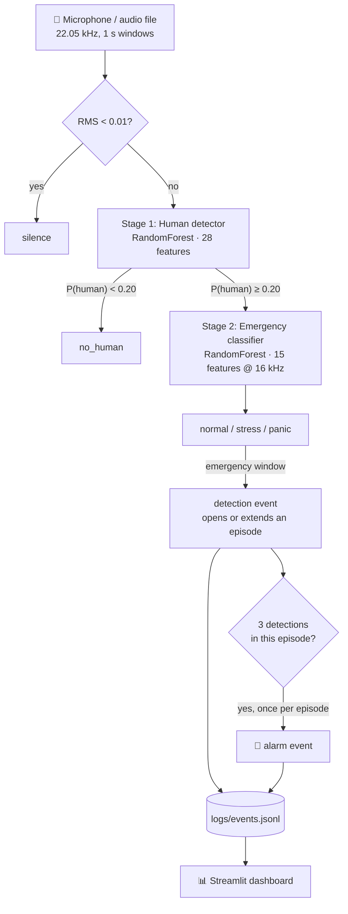

# 🚨 Acoustic Survivor Detection Under Rubble

**Detecting trapped survivors after an earthquake by listening for stressed and panicked human voices.**

A real-time, two-stage audio pipeline: it first decides whether a sound contains a
human voice, then classifies the emotional state of that voice (normal / stress /
panic). Consecutive emergency windows are grouped into one episode, and an episode
that lasts long enough raises a single operator alarm on a live dashboard.

> **Status:** an operator aid and research prototype, not a rescue decision tool.
> It has not been tested on audio recorded through real rubble; see
> [docs/EVALUATION.md](docs/EVALUATION.md).


---

## Contents

- [Why](#why)
- [How it works](#how-it-works)
- [Project structure](#project-structure)
- [Installation](#installation)
- [Usage](#usage)
- [Data](#data)
- [Training](#training)
- [Evaluation](#evaluation)
- [Known limitations](#known-limitations)
- [Roadmap](#roadmap)
- [License](#license)

---

## Why

In the first 72 hours after an earthquake, locating people trapped under debris is a
race against time. Rescue teams already use acoustic listening devices, but a person
has to interpret the sound. This project explores whether a lightweight model can
listen continuously and flag the moments that most likely contain a person in
distress, so operators can focus their attention there.

Design goals:

- **Real time on a laptop CPU.** Inference takes about 30–60 ms per 1-second window.
- **Few false alarms.** A two-stage design, plus episode grouping: many emergency
  windows in a row still produce one alarm.
- **Explainable.** Hand-crafted acoustic features and tree ensembles, no black-box
  deep model.

---

## How it works



### Stage 1: Is there a human voice?

A binary RandomForest (300 trees) trained on emotional speech corpora (human) and
ESC-50 environmental sounds (non-human). ESC-50 classes that contain human vocal
sounds (crying baby, coughing, laughing, sneezing, breathing, snoring) are excluded
from the non-human side.

| # | Feature |
|---|---|
| 13 | MFCC means |
| 13 | MFCC standard deviations |
| 1 | Zero-crossing rate (mean) |
| 1 | RMS energy (mean) |

### Stage 2: What state is the voice in?

A 3-class RandomForest (300 trees, class-balanced). The audio is resampled to
16 kHz first, the rate the model was trained at.

| # | Feature |
|---|---|
| 13 | MFCC means |
| 1 | RMS energy (mean) |
| 1 | Spectral centroid (mean) |

A window counts as an emergency when the predicted class is not `normal` and
`1 − P(normal) ≥ 0.5`.

### Detections, episodes and alarms

The listener writes three event types to `logs/events.jsonl` (append-only):

| Event | Meaning |
|---|---|
| `detection` | One 1-second window was classified as an emergency. **Not an alarm on its own.** |
| `alarm` | The current episode reached **3 detections**. Raised once per episode, at least 5 s after the previous alarm. |
| `episode_end` | A normal-speech or no-human window closed the episode. Silence does not close it (the person may be pausing for breath). |

Every feature definition lives in a single module, [`features.py`](features.py),
imported by the training scripts, the evaluation scripts and the live pipeline.
Each trained model ships with a JSON metadata file recording the feature spec it was
trained with, and `pipeline.py` refuses to load a model whose spec does not match
the code.

---

## Project structure

```
├── features.py              # single source of truth for feature extraction + feature spec
├── dataset.py               # dataset layout, per-corpus label parsers, speaker-level splits
├── augment.py               # training augmentations + rubble-like evaluation conditions
├── evaluation.py            # metrics: per-class P/R, confusion matrix, false-alarm & miss rate
├── pipeline.py              # two-stage inference, model loading with validation
├── events.py                # detection/alarm event log, episode tracker, listener heartbeat
├── audio_input.py           # CLI: analyse one audio file
├── live_listener.py         # real-time microphone listener
├── app.py                   # Streamlit dashboard: listener control, alarms, detections
│
├── scripts/
│   ├── download_data.py     # 1. fetch datasets from their original sources
│   ├── build_manifest.py    # 2. → data/manifest.csv
│   ├── extract_features.py  # 3. → features/{emergency,human}.npz
│   ├── train.py             # 4. → models/*.pkl + models/*.json
│   ├── evaluate.py          # 5. → reports/*.json
│   └── prepare_training.py  # runs 1–3 (and 4–5 with --train) in one go
│
├── docs/EVALUATION.md       # evaluation protocols and field-test plan
├── models/                  # trained models (Git LFS) + metadata
├── samples/                 # sample clips for a quick try
└── tests/                   # pytest suite
```

---

## Installation

```bash
git clone https://github.com/BurakYildizGameDev/Stress_Detection_from_Sound_Signals_and_Application_to_Detecting_Survivors_Under_Rubble.git
cd Stress_Detection_from_Sound_Signals_and_Application_to_Detecting_Survivors_Under_Rubble
git lfs pull                      # trained models
pip install -r requirements.txt
```

> The models were saved with **scikit-learn 1.8.0**, which is pinned in
> `requirements.txt`. Other versions emit `InconsistentVersionWarning` and may
> produce wrong predictions.

If a model file is missing, is still a Git LFS pointer, or was trained with
different features, `pipeline.py` stops with a message that says which of these it
is and what to run.

---

## Usage

### Analyse a file

```bash
python audio_input.py samples/people_talk.mp3
```

### Listen in real time

```bash
streamlit run app.py
```

Start and stop the listener from the dashboard's sidebar. The sidebar shows whether
the listener is actually running (it writes a heartbeat every second), which
microphone it uses and the current input level. You can also run it in a terminal
with `python live_listener.py`; the dashboard picks it up either way.

The dashboard has four tabs:

- **Dashboard:** listener state, number of alarms, episodes and detection windows.
- **Alarms:** one row per operator alarm, with CSV export.
- **Detection windows:** every emergency window, grouped by episode, with CSV export.
- **Statistics:** class distribution of detections and episode lengths.

"Archive logs" moves `logs/events.jsonl` into `logs/archive/` instead of deleting it,
so nothing is lost while the listener is writing.

### Use it from Python

```python
from pipeline import analyze_file, analyze_audio_array

result = analyze_file("recording.wav")
# {'status': 'DETECTED', 'state': 'panic', 'is_emergency': True,
#  'human_prob': 0.82, 'emergency_prob': 0.77, 'all_probs': {...}}
```

### Tests

```bash
python -m pytest tests
```

---

## Data

The datasets are **not redistributed** in this repository, because several of them
have non-commercial or no-derivatives licenses. The download script fetches them
from their original sources:

```bash
python scripts/download_data.py --list    # sources and licenses
python scripts/download_data.py           # everything that can be fetched automatically
python scripts/download_data.py tess      # a single dataset
```

| Dataset | Language | Role | License | Download |
|---|---|---|---|---|
| [RAVDESS](https://zenodo.org/records/1188976) (song) | English | human | CC BY-NC-SA 4.0 | automatic |
| [Berlin EMO-DB](http://emodb.bilderbar.info/) | German | human | free w/ attribution | automatic |
| [TESS](https://doi.org/10.5683/SP2/E8H2MF) | English | human | CC BY-NC 4.0 | automatic |
| [SUBESCO](https://zenodo.org/records/4526477) | Bangla | human | CC BY 4.0 | automatic (~1.7 GB) |
| [SAVEE](http://kahlan.eps.surrey.ac.uk/savee/) | English | human | research only | manual |
| [JL-Corpus](https://www.kaggle.com/datasets/tli725/jl-corpus) | English (NZ) | human | CC0 | manual |
| [ESC-50](https://github.com/karolpiczak/ESC-50) | — | non-human | CC BY-NC 3.0 | automatic |
| [VIVAE](https://doi.org/10.5281/zenodo.4066235) | non-verbal | human, **test only** | CC BY-NC 4.0 | automatic |
| [VocalSound](https://github.com/YuanGongND/vocalsound) | non-verbal | human (v2 only) | CC BY-SA 4.0 | automatic (~1.7 GB) |
| [Nonspeech7k](https://doi.org/10.5281/zenodo.6967442) | non-verbal | human (v2 only) | CC BY-NC-SA 4.0 | automatic (~2.5 GB, slow) |
| ESC-50 human vocal classes | non-verbal | human (v2 only) | CC BY-NC 3.0 | with ESC-50 |

### Manifest

`scripts/build_manifest.py` turns the downloaded files into `data/manifest.csv`, one
row per recording with: path, dataset, license, speaker, recording ID, emotion,
emergency class, train/test split and transform. Every later step reads this file.

- **Labels come from each corpus's own naming scheme**, parsed per dataset in
  [`dataset.py`](dataset.py), not from substrings in file names. Each recording gets
  at most one class:

  | Emotion in corpus | Class |
  |---|---|
  | neutral, calm | `normal` |
  | angry | `stress` |
  | fear / fearful | `panic` |
  | anything else | not used by the emergency classifier (still `human` for stage 1) |

- **Duplicates are dropped** by recording ID (the TESS download contains a second
  copy of all 2,800 files).
- **Splits are speaker-disjoint:** about 20% of each corpus's speakers go to the
  test set, so no speaker appears on both sides. ESC-50 uses its official fold 5.

With all six speech corpora, the emergency set has **5,839 recordings**: 2,115
normal, 2,011 stress and 1,713 panic.

---

## Training

```bash
python scripts/prepare_training.py            # download → manifest → features
python scripts/train.py --task all            # train both models
python scripts/evaluate.py --task all --protocol all
```

Or step by step:

```bash
python scripts/download_data.py
python scripts/build_manifest.py
python scripts/extract_features.py --task all   # --no-augment, --max-per-dataset N
python scripts/train.py --task emergency        # or human
```

Augmentation (noise, ±2 semitone pitch shift for speech; noise, shift and volume for
environmental sounds) is applied **only to training-split recordings**, after the
split, so augmented copies of a test recording cannot leak into training. Every
feature row records its source path and transform.

`train.py` trains on the training split, prints the held-out speaker evaluation, and
writes `models/<name>.pkl` together with `models/<name>.json` (labels, feature spec,
scikit-learn version, manifest hash, metrics).

---

## Evaluation

See [docs/EVALUATION.md](docs/EVALUATION.md) for the protocols and the field-test
plan. `scripts/evaluate.py` reports per-class precision/recall, a confusion matrix,
the **false-alarm rate** and the **miss rate** for three protocols: held-out
speakers, leave-one-corpus-out, and synthetic rubble-like conditions (noise,
attenuation, low-pass filtering).

All numbers below come from `reports/` (models trained on 2026-09-27, all six speech
corpora + ESC-50). Test recordings are original clips from speakers the model never
saw.

### Emergency classifier (normal / stress / panic)

Held-out speakers: **accuracy 0.666, macro-F1 0.650**, n = 1,587.

| | precision | recall | F1 | support |
|---|---|---|---|---|
| normal | 0.765 | 0.750 | 0.757 | 568 |
| stress | 0.633 | 0.785 | 0.701 | 544 |
| panic | 0.575 | 0.429 | 0.492 | 475 |

| true ↓ / predicted → | normal | panic | stress |
|---|---|---|---|
| **normal** | 426 | 102 | 40 |
| **panic** | 63 | 204 | 208 |
| **stress** | 68 | 49 | 427 |

- **False-alarm rate 0.25:** a quarter of calm speech is flagged as an emergency.
- **Miss rate 0.13:** stressed/panicked speech predicted as normal.
- Panic and stress are often confused with each other (208 panic → stress), which
  matters less, because both count as an emergency.

**Unseen corpus** (leave-one-corpus-out, macro-F1): TESS 0.59, Berlin 0.47,
RAVDESS 0.47, SUBESCO 0.39, JL 0.38, SAVEE 0.23. The error type also swings between
corpora: on SUBESCO and Berlin most normal speech becomes an alarm (false-alarm rate
0.83 / 0.79), while on SAVEE almost every emergency is missed (miss rate 0.97). The
model has learned a lot about recording setup and language, and not only about
emotion.

**Rubble-like conditions** (held-out speakers, macro-F1 / false-alarm / miss):

| Condition | macro-F1 | False alarm | Miss |
|---|---|---|---|
| clean | 0.650 | 0.250 | 0.129 |
| noise 20 dB SNR | 0.649 | 0.371 | 0.102 |
| noise 10 dB SNR | 0.567 | 0.375 | 0.153 |
| noise 0 dB SNR | 0.482 | 0.607 | 0.066 |
| −20 dB (distance) | 0.287 | 0.005 | **0.820** |
| low-pass 1 kHz | 0.556 | 0.165 | 0.301 |
| low-pass 400 Hz | 0.178 | 0.005 | **0.997** |
| `rubble_sim` (400 Hz + −20 dB + 10 dB noise) | 0.183 | 0.000 | **0.995** |

This is the most important result: **a quiet or muffled voice is almost always
classified as `normal`.** The features include absolute RMS energy and spectral
centroid, so the model partly learned "loud and bright = emergency", which is
exactly what rubble takes away. Loudness-normalised features and debris-filtered
training data are needed before this stage is useful under rubble.

### Human detector (human / non_human)

Held-out speakers + ESC-50 fold 5: **accuracy 0.977, macro-F1 0.976**, n = 833.
False-alarm rate 0.051 (18 of 352 environmental sounds taken for a voice), miss rate
0.002.

| Condition | macro-F1 | False alarm | Miss |
|---|---|---|---|
| clean | 0.976 | 0.051 | 0.002 |
| noise 10 dB SNR | 0.706 | 0.006 | 0.497 |
| noise 0 dB SNR | 0.297 | 0.000 | 1.000 |
| low-pass 1 kHz | 0.863 | 0.003 | 0.235 |
| `rubble_sim` | 0.505 | 0.031 | **0.769** |

On an unseen corpus the miss rate rises to 0.42 (Berlin) and 0.31 (SUBESCO).

### Sample clips (1-second windows)

| Clip | Result | Verdict |
|---|---|---|
| `people_talk.mp3` | 3 normal, 1 stress, 1 panic | ⚠️ 2 emergency windows (no alarm: not 3 in a row) |
| `car_start.mp3` | no human | ✅ |
| `bird.mp3` | 5/5 windows flagged as emergency | ❌ false alarm |
| `woman_scream.mp3` | mostly "no human", 1 stress window | ❌ missed |

### Previous model, for comparison

The old 4-class emergency classifier scored 0.864 accuracy on a random 80/20 split
with augmented copies on both sides, and 0.630 ± 0.11 in speaker-independent
cross-validation. The random-split number was inflated by leakage; the new 0.666 on
held-out speakers is the comparable figure.

### v2 (5 classes: + whisper, moan) — experimental, not used by the live pipeline

`python scripts/extract_features_v2.py --task all && python scripts/train_v2.py --task all`.
Whisper and moan training data are **synthetic** (`whisper_converter.py`). Features are
loudness-normalised, randomised rubble augmentation is applied to every class, and
test rows come from unseen speakers under fixed rubble conditions. Real recordings
that are never trained on ([VIVAE](docs/REAL_DATA.md): 89 mild-pain moans, 176 fear
vocalisations) are reported separately. Full numbers: `reports/*_v2*.json`.

| Test set (unseen speakers) | Emergency v2 macro-F1 | whisper recall | moan recall | normal recall |
|---|---|---|---|---|
| clean | 0.798 | 0.97 (synthetic) | 0.97 (synthetic) | 0.77 |
| rubble mild / medium / severe | 0.49 / 0.59 / 0.45 | 0.93–1.00 | 0.86–0.98 | 0.13–0.48 |
| **VIVAE real moans, clean** | — | — | **0 / 89** | — |

What this shows:

1. **The synthetic whisper/moan scores measure the converter, not real voices.** Real
   moans from VIVAE are classified as `stress` (54) or `normal` (26), never `moan`.
   Under simulated rubble more of them become `moan`, but so do real fear screams
   (41/176 under severe rubble): the model has learned "low-passed audio = moan".
2. **The speech-only human detector rejected non-verbal vocalisations.** 95% of VIVAE
   clips (moans, screams, groans) were classified `non_human` by v2, and 97% by v1, so a
   survivor who moans instead of talking never reached stage 2. Retraining with
   non-verbal human sounds (ESC-50 breathing/coughing/crying/snoring, VocalSound,
   Nonspeech7k test part, grouped by source recording) fixes most of this, at the cost
   of false alarms on animal and water sounds (`--quick` run: clean + medium rubble):

   | Human detector v2 (test set) | speech-only | + non-verbal | + hard negatives, threshold 0.45 |
   |---|---|---|---|
   | VIVAE real vocalisations, clean / medium rubble | 0.05 / 0.18 | 0.88 / 0.78 | **0.70 / 0.57** |
   | Nonspeech7k test (screams, crying, breath...) | – | 0.80 | 0.69 |
   | Acted speech | 0.99 | 1.00 | 0.98–1.00 |
   | ESC-50 false-alarm rate, clean / medium rubble | 0.045 | 0.32 / 0.35 | **0.18 / 0.24** |

   Extra augmentation of the non-human clips (pitch ±3, time-stretch, a second rubble
   variant) did **not** improve separability: at equal false-alarm rates the two models
   are within 1–3 points (0.32 → 0.88 vs 0.89, 0.10 → 0.38 vs 0.40). It only moved the
   default operating point. MFCC statistics + random forest seem to hit a ceiling on
   "animal call vs. human moan"; pretrained audio embeddings are the next step.

   The threshold is no longer hard-coded: `train_v2.py` holds out 15% of the training
   groups, and picks the lowest threshold whose false-alarm rate there is ≤ 20%
   (`--target-false-alarm`). It chose 0.45 without looking at the test set.
   `pipeline_v2` reads it from `models/human_detector_v2.json` (it used to be a fixed 0.20,
   which gave a 0.65 false-alarm rate). 20% was chosen as a field trade-off: the
   operator confirms every alarm by ear, and at 10% only ~40% of real moans are caught.

3. Cost-sensitive class weights (whisper 8×, moan 6×) did not raise whisper/moan
   recall over `class_weight="balanced"` (0.97 in both) but raised the false-alarm rate
   from 0.169 to 0.232 (`reports/emergency_v2_balanced.json`).
4. Rubble simulation still collapses the speech classes (normal recall 0.13–0.48).

---

## Known limitations

These are stated openly on purpose:

1. **Quiet or muffled voices are classified as `normal`.** Under −20 dB attenuation
   or a 400 Hz low-pass, the emergency classifier misses 82–100% of emergencies (see
   Evaluation). This is the main blocker for use under rubble.
2. **No scream class.** There is no real scream data yet. The old `scream` class
   was 14 TESS recordings (42 after augmentation) of speakers saying the *word*
   "shout", so it was removed.
3. **Acted speech only.** All emotion data is actors reading sentences, which is not
   what a trapped person calling for help sounds like.
4. **False alarms:** a quarter of calm speech from unseen speakers, and non-speech
   sounds such as birdsong.
5. **Clip-length mismatch.** The emergency classifier is trained on whole 2–3 s
   clips, while inference uses 1 s windows.
6. **No Turkish speech** in the training data, even though the target deployment is
   in Turkey.
7. **No rubble acoustics.** The robustness protocol only simulates noise,
   attenuation and low-pass filtering; nothing has been recorded through real
   debris.

---

## Roadmap

- [x] Single feature module shared by training and inference
- [x] Dataset download script; no redistribution of licensed audio
- [x] pytest suite
- [x] Manifest with per-corpus labels and speaker-disjoint splits
- [x] Evaluation with confusion matrix, false-alarm and miss rates
- [x] Detections vs. alarms separated; dashboard controls the listener
- [x] Retrain both models with the new pipeline and publish the reports here
- [x] Loudness-normalised features (v2)
- [x] External real-data test set (VIVAE) and a folder for field recordings ([docs/REAL_DATA.md](docs/REAL_DATA.md))
- [x] Human detector trained with non-verbal vocalisations (moans, screams) as `human`
- [ ] Separate animal calls from human moans (18% false alarms at 70% recall): pretrained embeddings, more non-human data
- [ ] Real whispered speech (CHAINS / wTIMIT / own recordings)
- [ ] Real scream / distress-call data (e.g. the AudioSet *Screaming* class)
- [ ] Knock/tap detection via onset analysis, the most realistic signal from under rubble
- [ ] Pretrained audio embeddings (YAMNet / PANNs) as features
- [ ] Room-impulse-response augmentation to simulate debris
- [ ] Field tests from [docs/EVALUATION.md](docs/EVALUATION.md)
- [ ] ONNX export for edge devices
- [ ] GitHub Actions CI

---

## License

The code is released under the [MIT License](LICENSE). The datasets keep their own
licenses; see the table above or run `python scripts/download_data.py --list`.
